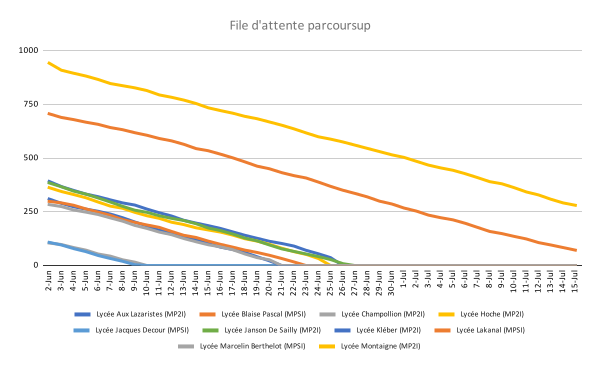
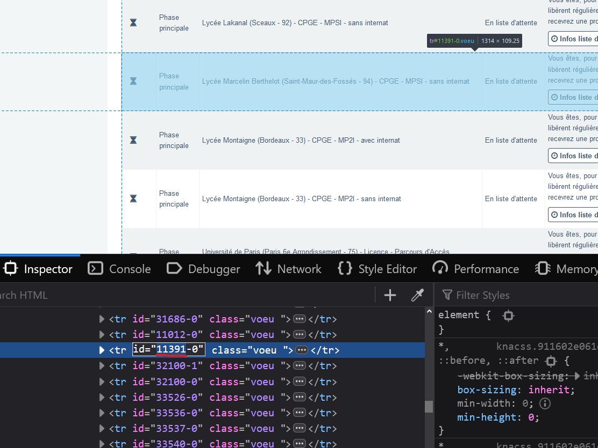

# Parcoursup File d'attente

Afficher l'évolution de votre place dans les files d'attentes de vos voeux parcoursup. Exemple :



## Utilisation

```sh
npm install

# Remplir le fichier .env avec
DOSSIER= # Dossier Parcoursup
PASSWORD= # Mot de passe Parcoursup
GOOGLE_SERVICE_ACCOUNT_EMAIL= # Email de service google
GOOGLE_PRIVATE_KEY= # Clé associée
DOC_ID= # ID du gsheet ex : 1PeTo-GzhU8k1Xrxsqh4xy-iCP8NDe_d7_CXUSM6sPbk
SHEET_ID= # ID de la feuille avec le tableau

# DOC_ID et SHEET_ID sont dans l'url du gsheet
```

Configurez le tableau en suivant [cette exemple](https://docs.google.com/spreadsheets/d/1eRMTs2GWkfeYLwmfUruiNCoKbQ1JIKjs51TqI-ACIRw), l'ID de chaque voeux peut se trouver en inspectant la page d'admission comme ici :



Enfin, exécutez la commande suivante chaques jours

```
node index.js
```
